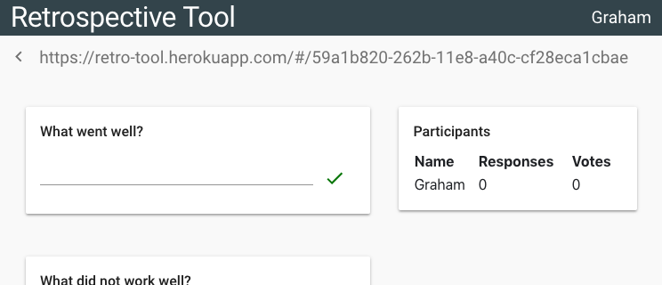

# Retrospective Tool

## Install
Either install the server locally (see [here](https://github.com/alphaeadevelopment/retro-tool/blob/master/docs/README.md)) for instructions or use the
[online demo](https://retro-tool.herokuapp.com/)

## Create a session
Click the 'Create Session' link and enter your name.

## Share the generated unique link with participants

## Monitor as participants join and submit responses

## Add additional questions

## Block inappropriate/duplicated responses

## Start voting

## Monitor incoming votes

## Close for discussion
