# Retrospective Tool

## Install
Either install the server locally (see [here](https://github.com/alphaeadevelopment/retro-tool/blob/master/docs/README.md)) for instructions or use the
[free hosted service](https://retro-tool.herokuapp.com/).

_IMPORTANT: Please note that no assurances are given or implied with regards to the resilience or security of data on the hosted service. Sessions with no connected participants are frequently purged in order to keep the size of the data store within the hosted platform's free tier_

## Start a new session
Click the 'Host new session' link and enter your name when prompted.
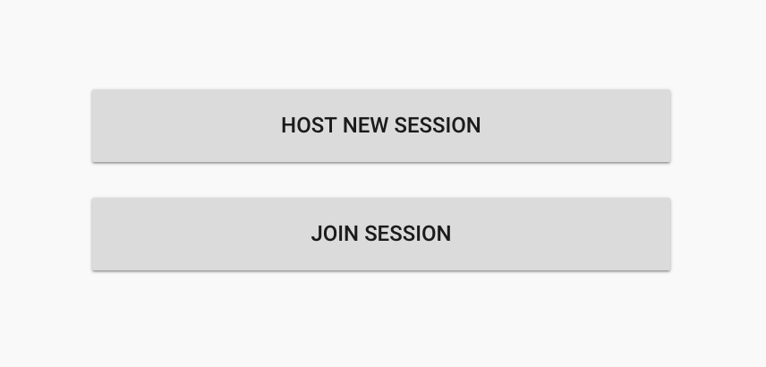

## Share the generated session id or link with participants
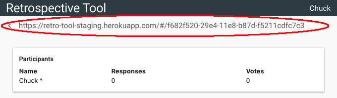

## Monitor as participants join and submit responses
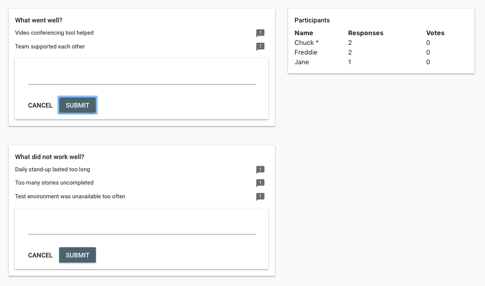

## Add additional questions
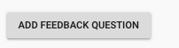

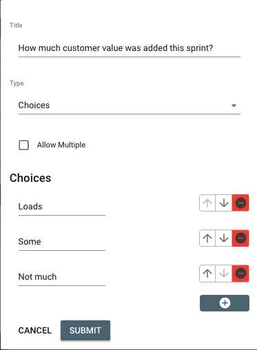

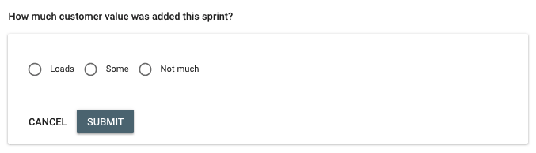

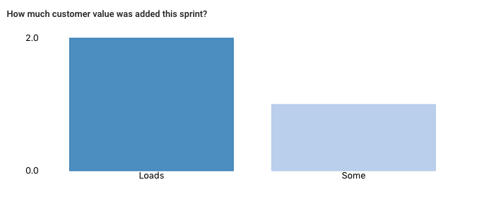

## Block inappropriate/duplicated responses
Block inappropriate or duplicated responses:

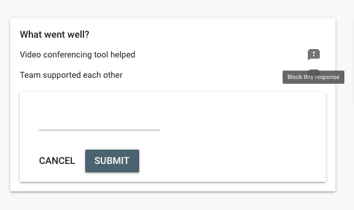

Provide a reason:

The user will receive a notification and reason:

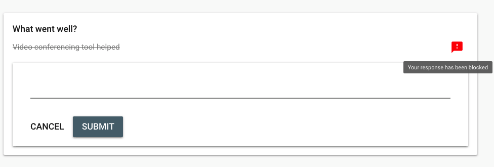

## Start voting

Session owner can open for votes.

At this point, all participants can see others' responses and vote on their top three responses. Blocked responses are not shown.

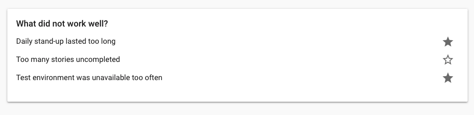

All users can see the number of votes cast be each participant.

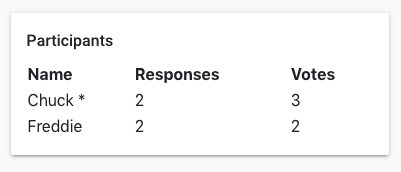

## Close for discussion

The session owner can go back to the previous state and allow additional responses, or finalise the session so that all participants can see votes for each response.

