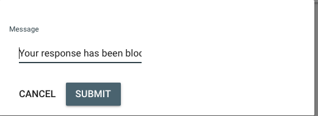
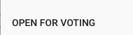

# Retrospective Tool

## Install
Either [install and run the server on your local machine](https://github.com/alphaeadevelopment/retro-tool/blob/master/docs/README.md) or use the
[free hosted service](https://retro-tool.herokuapp.com/).

_IMPORTANT: No assurances are made in respect of either the resilience or the security of data submitted to the hosted service. Although the hosted service does persist session data in a mongo database, it will periodically sweep and purge any sessions that have no connected users. This is to ensure that the size of the datastore remains within free usage limits._

## Start a new session
Click the 'Host new session' link and enter your name when prompted.

## Share the generated session id or link with participants

## Monitor as participants join and submit responses

## Add additional questions

## Block inappropriate/duplicated responses
Block inappropriate or duplicated responses:

Provide a reason:

The user will receive a notification and reason:

## Start voting

Session owner can open for votes.

At this point, all participants can see others' responses and vote on their top three responses. Blocked responses are not shown.

All users can see the number of votes cast be each participant.

## Close for discussion

The session owner can go back to the previous state and allow additional responses, or finalise the session so that all participants can see votes for each response.

